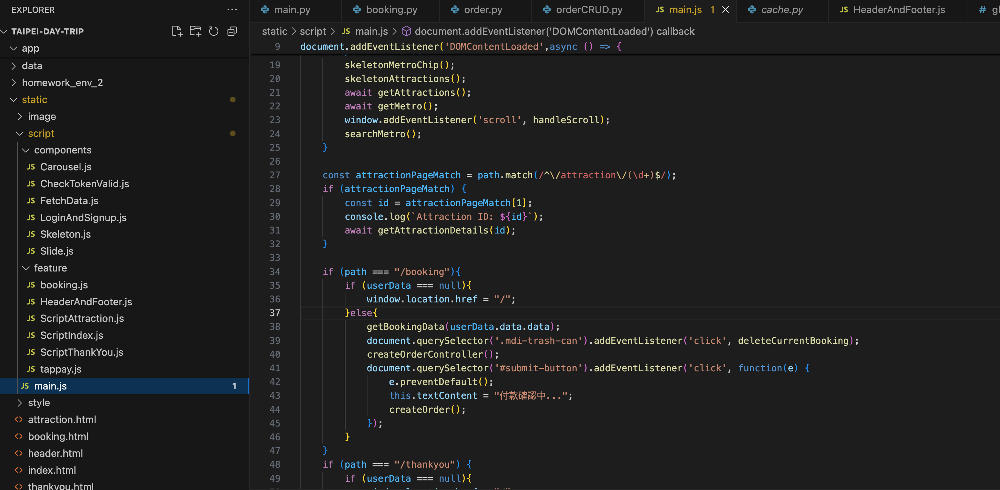
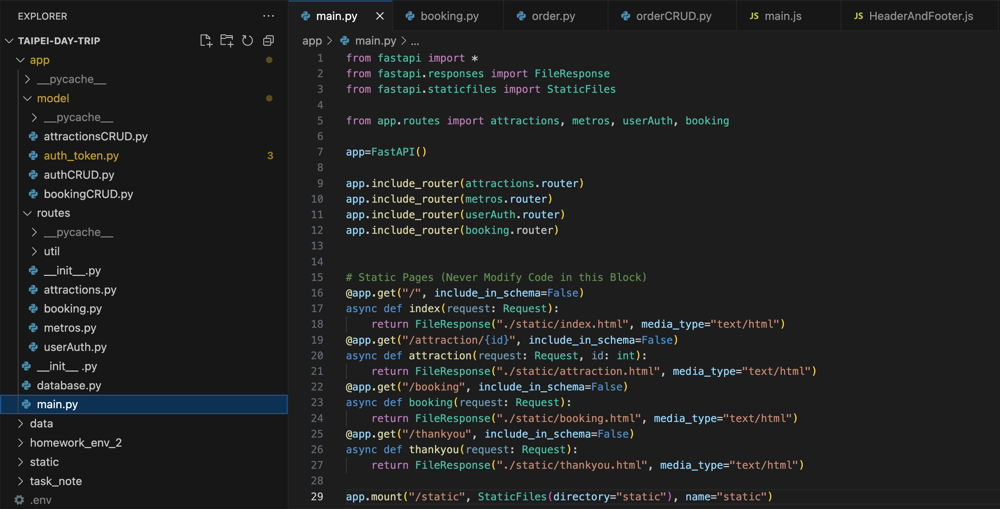

# Taipei Travel Search
### http://35.75.244.94:8000/

> Helping you quickly find Taipei’s attractions and plan your trip using real-time transit and points-of-interest data

### Tech Stack
<p align="center">
  
</p>

- Frontend / Backend Separation (MVC)
- Backend: FastAPI
- Database Design: MySQL
- Deployment: AWS EC2
- Authentication: Registration & Login
- Payments: TapPay integration
- Third-Party APIs:
  - Taipei Attractions API
  - Taipei Metro API


## Website DEMO
### Homepage Overview
- Lazy Loading
- Skeleton Loading Animation for smooth UX feedback
<p align="center">
  
</p>

- Keyword Search with instant results
- Component & Interface Design System, fully Responsive

<p align="center"> 
    
</p>

### Login & Registration
- Modular Header & Footer components
- Auto-login immediately after sign-up
- Redirect to specified page on success 

```javascript
function loginAndSignupPop(targetURL = false) { … }
```
<p align="center"> 
     
</p>

### Booking Flow
- TapPay payment integration
<p align="center"> 
     
</p>

#### Tech
- Architecture Diagrams
- Frontend (FE_MVC)

<p align="center"> 
     
     
</p>

### References
- [Taipei Metro API](https://www.metro.taipei/cp.aspx?n=BDEB860F2BE3E249)
- Taipei attractions data provided by WeHelp