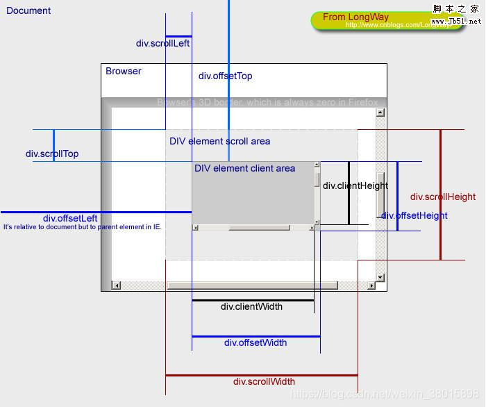

*design the home page and use 3 apis set from last week*
---
## layout design
- build design system
	- add global css style (guideline)
	- 確認 CSS 設定是否和 Figma 上的數值要一模一樣，重點是【視覺上】完全一致。目前設計稿上的  line-height 普遍給的比 font-size 小，會導致文字匡高比文字小，在設定時給比較大的設定
- check detail
	- 依週一會議 demo 圖片是 4 -> 2 -> 1 顯示，使用 `@media` 切三個版設計，檢查設計稿上其餘沒有調整，如在 mobile 的 padding, margin 之類的，所以總共只調整了 gallery 圖卡排版 
- component/ carousel next/last chevron and carousel chip
	- 設計：
		- scrollWidth > clientWidth 顯示右側按鈕，但是當 scrollWidth - scrollleft = clientWidth 等於沒東西滑了，隱藏右邊按鈕
		- 當 scrollleft > 0 顯示左側按鈕
		- 設定單次點擊滑動的距離 = 4/5
		- `elemt.width`, `elemt.height` , `scrollTop`, `offsetTop`, `scrollLeft`, `offsetLeft`...
		- `elemt.scrollBy()`, `elemt.scrollTo()`, `window.pageXOffset()`, `window.pageYOffset()`, `elemt.scrollLeft()`, `elemt.scrollTop()`
		- 
	- 紀錄：用 `window.addEventListener('resize', carouselBtnState);` 偵測即時螢幕寬度變動
	- 問題：滑到右側底時，右側按鈕沒有消失。當有往右滑動時，左側按鈕沒有顯示
		- 使用 `Math.ceil()` 避免小數差問題（雖然我覺得這不是最主要原因，但還是加一下）
		- `Math.ceil()` 函式會回傳大於等於所給數字的最小整數。
		- `scrollBy()` 是非同步的，滾動還沒結束就檢查狀態，會導致按鈕錯誤顯示。使用時間延遲來等滾動結束`setTimeout(carouselBtnState, 300)` 再做檢查
		- 還是找不到，把所有資料都印出來看，發現偏移位置每次點擊都是 0 ，原來是計算成容器的偏移位置，應該要計算總長度的偏移位置
- component/ attraction card
	- `::after`：在元素的內容之後插入內容。 卡片是整張被 hover 的感覺，使用了 `::hover` 去增加一個類似遮罩的物件在整個卡片上方


## api application
- /api/attractions/attractions?page=0
	- 紀錄：原本想用之前作業的做法，建立空的 html 然後將資料塞入，如果有往下滑動，就利用 `cloneNode()` 的方式複製 html 去塞新的資料，但這次在做的時候想到是不是用 `innerHTML` 會更乾淨，就不用分進入畫面先塞一次資料，之後還要 clone （會有兩個 function）而且因為 api 來自自己，就比較不會有危險（？）
- load next page by using window scroll event with getBoundingClientRect method
	- 紀錄：page=0 改用全域變數
	- 使用 function handleScroll()
	- 使用 window scroll event 判斷是否需要 load 時的重複判斷問題顯示

```javascript
    function handleScroll(){
        const {scrollTop, scrollHeight, clientHeight} = document.documentElement;
        if (scrollTop + clientHeight >= scrollHeight - 80){ //footer 104px
		          console.log("load next page", `${scrollHeight - (scrollTop + clientHeight)}`)
		          // getAttractions(nextPage);
        }
    }
```
- 
	- **防抖（debouncing）**：在滾動觸發的過程中設置延遲時間，只有在滾動停止一段時間後才發送請求。
	- **節流（throttling）**：控制 API 請求的觸發頻率，避免短時間內過多請求。

- make metro table and join the data
	- 紀錄：有在思考是不是應該有正確的 mrt table （就是順序或是包含路線顏色等），看了一下公共運輸的 api 應該可以撈到！但是先把功課完成好了，有機會再試
	- 紀錄：整理 metro 資料同上週在處理  /api/mrts
	- 列表推導式 (List Comprehension) 及 `list()` + 生成器表達式 (Generator Expression)
	- 設計：
		- 修改 attractions 的資料結構
		- 先建立一個新的 mrt_id 並外鍵，再刪除原本的 mrt
	- 紀錄：修改舊的三隻 api 用 join 的方式要 mrt 資料 ，現在直接從新的 table 抓，就不用篩資料。但是 SELECT 的內容變得很複雜 🤣
- update new sql to ec2
- /api/mrts
	- 做法有點同 /api/attractions/attractions?page=0
- component/ search input
	- 紀錄：使用同一隻 api 邏輯應該要寫在一起
	- 紀錄：偷加了一個 loading gif （雖然應該要用）應該有更正規的做法（Load），但因為這邊加搜尋功能需要每次在 page=0 時清空資料，所以先加了個小動畫
- chip search
	- 紀錄：在做點擊功能時遇到跟在判斷是否需要  carousel next/last chevron 時一樣的問題，就是因為是用動態加載內容的，所以在內容加載完成前就已經先執行了 `carousel()` `searchMetro()` 所以會出錯。故在 `renderMetroChip()` 最後再加上 `carousel()` `searchMetro()` 確保事件綁定成功
	- 紀錄：增加鍵盤 enter 的輸入功能
## deploy
## others
- 機會點：查詢 pure html+css 怎麼處理 component，將 component 獨立出來
	- Components（元件）
		- `AttractionsList`：負責渲染景點清單
		- `fetchData.js`：處理 API 請求
		- `Carousel`：單純 chip 跟左右點擊的需求
	- Features（功能模組）
		- `ScriptIndex.js`：index 頁面需要的行為：gallery 渲染及 metroChip 渲染及行為
	```
		static
		∟ script
		∟∟components
		∟∟∟AttractionsList.js
		∟∟∟Carousel.js
		∟∟∟FetchData.js
		∟∟feature
		∟∟∟ScriptIndex.js
		∟∟main.js
	```
- 機會點：mrts table 排序應該可以用[公共運輸的 api](https://www.metro.taipei/cp.aspx?n=BDEB860F2BE3E249) ，而不是從目前 json 中的資料去撈出 mrt 資料
	- 取得[資料](https://tdx.transportdata.tw/api/basic/v2/Rail/Metro/Station/TRTC?%24format=JSON)
	- 建立新的 table metroNEW
	- attractions table 取消外鍵到 metro 上，更新 attractions mrt_id 為 metroNEW 的 mrtID 再外鍵到 metroNEW 上

		```mysql
		# 找到外鍵
		SELECT CONSTRAINT_NAME FROM information_schema.KEY_COLUMN_USAGE WHERE TABLE_NAME = 'attractions' AND COLUMN_NAME = 'mrt_id';
		# 刪除外鍵
		ALTER TABLE attractions DROP FOREIGN KEY fk_metro_id;
		```
	- 紀錄：api 中的“臺大醫院”是“台大醫院”，改 metroNEW 的資料
		- `UPDATE metroNEW SET mrt = '臺大醫院'  WHERE id=101;`
	- 更新三隻 api
	- 重新上傳 db 到 ec2
- 機會點：增加等待時的 loading 畫面
	- 機會點：增加等待時的 loading 畫面 > skeleton
	- 利用 css 在上面增加灰色狀態樣式，所以要做的話可以先創造空的匡然後資料跑完後清空原本內容，再動態放資料